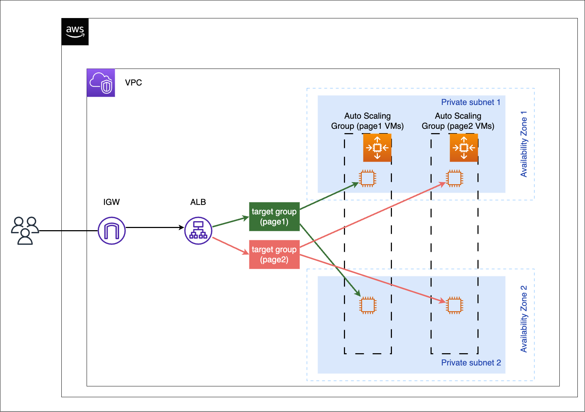

# Marketplace Engineer Task
# 1. Terraform and Linux
## The concept of the solution based on task description
1. Hashicorp Packer tool is used to generate a customized AMI VM image in AWS
* 2 HTML pages files are copied (page1.html, page2.html)
* NGINX web server is installed
2. The AWS cloud infrustructure on the diagram below is provisioned with Hashicorp Terraform tool, the source image for the VMs in the ASGs is the AMI VM image pre-created with Packer (the same image for `page1.html` hosting and `page2.html` hosting VMs) 

# Packer
## Build a customized AMI image with packer
### the `packer` directory structure in this repo
```bash
.
├── aws-ubuntu.pkr.hcl
├── page1.html
└── page2.html
```
### the `aws-ubuntu.pkr.hcl` template
 * using the `github.com/hashicorp/amazon` plugin for `amazon-ebs` builder
 * build source is an official Amazon Ubuntu 22.04 server AMI VM image
 * using a `file` and a `shell` provisioner during the build process
   * copying 2 HTML page files to the VM
   * installing nginx webserver on the VM 
 * the output is a customized Ubuntu 22.04 AMI VM image
# Terraform

## the `terraform` directory structure in this repo
```bash
.
├── main.tf
├── modules
│   ├── autoscaling-lb
│   │   ├── main.tf
│   │   ├── outputs.tf
│   │   └── variables.tf
│   └── network
│       ├── main.tf
│       ├── outputs.tf
│       └── variables.tf
├── outputs.tf
├── terraform.tf
├── terraform.tfvars
└── variables.tf
```
## Version, provider and backend configuration
The `terraform.tf` file is used to enforce the terraform CLI version and the `aws` provider version.
For terraform statefile, an AWS `s3` backend is declared in `terraform.tf` file. The `s3` bucket is manually pre-created in AWS cloud and so when terrraform is initializing then it can check the backend `s3` and when it creates the declared resource during `terraform apply`, it creates the statefile defined under the `key` parameter of the backend `s3` declaration.
The `aws` provider is configured with `tags` which means all resources provisioned by terraform in AWS will be tagged with those declared list of tags, except the `aws_autoscaling_group` resource, so for that the same tags are defined under that particular resource.   
## Modules and dependecies
The terraform root module is represented by the `terraform/main.tf` file of this git repo.
This root module calls 2 child modules:
* `module "network"`, network resources
* `module "autoscaling-lb"`, ALB and ASG resources

The `"autoscaling-lb"` module is implicitly dependent on the `"network"` module as it is using values for its arguments from the `"network"` module.
This dependency is handled by terraform automatically.

### Resources by modules
Resources provisioned by the `module "network"`:
* `aws_vpc`, a non-default VPC in the region
* `aws_subnet`, 1 in each of the 2 used availablity zones
* `aws_internet_gateway`, for the Internet egress and ingress traffic
* `aws_route_table`, associated with the subnets
* `aws_route_table_association`, map route table to subnets
* `aws_security_group` for the ALB and for the VMs in the ASGs

Resources provisioned by the `module "autoscaling-lb"`:
* `aws_launch_template`, used for VM parameters' definition and using the packer tool created AMI VM image for the `image_id` and the `locals` for the user_data of the VMs, 2 LTs, 1 for each VM (page1, page2) type
* `aws_autoscaling_group`, 2 ASGs, 1 for each VM (page1, page2) type
* `aws_lb_target_group`, backend for the ALG, mapped to ASGs, 2 TGs, 1 for each VM (page1, page2) type
* `aws_autoscaling_attachment`, maps the target groups to autoscaling groups
* `aws_lb`, the Application Load Balancer, mapped to the backend subnets
* `aws_lb_listener`, the frontend public listener on HTTP/80
* `aws_lb_listener_rule`, 2 URL path based forwarding rules, `/page1.html` and `/page2.html`

## Variables
* root module variable declarations
  * `terraform/variables.tf`
* `"network"` child module variable declarations
  * `terraform/modules/network/variables.tf`
* `"autoscaling-lb"` child module variable declarations
  * `terraform/modules/autoscaling-lb/variables.tf`

The root module arguments are the child module variables and the root module is passing the values to the child modules via those arguments. The values are set in the `terraform/terraform.tfvars` file.
## Outputs
The outputs of the child modules are defined as the available resource attributes on those particular resources in a child module. Thsese outputs has 2 purposes:
* if those referred in the output of the root module then those attribute values are printed out to the terminal during the terraform `plan` or `apply`
* if those referred as argument values in the root module then those values from a child module passed to another child module. In this case the `"network"` module outputs are used for the "autoscaling-lb"` module.
# 2. Helm Chart
## the `helm` directory structure in this repo
```bash
.
└── nginx
    ├── Chart.yaml
    ├── charts
    ├── templates
    │   ├── NOTES.txt
    │   ├── _helpers.tpl
    │   ├── configmap.yaml
    │   ├── deployment.yaml
    │   ├── hpa.yaml
    │   ├── ingress.yaml
    │   ├── service.yaml
    │   ├── serviceaccount.yaml
    │   └── tests
    │       └── test-connection.yaml
    └── values.yaml
```

### The assesment described these 3 tasks for the Helm Chart creation:
Create a helm chart with nginx container we service that following inputs variables
1) Number nginx of replicas in pod - interger. Only values between 1 and 10 should be allowed
2) Content of a web page ( which has “Hello Word” value by default) - string value.
3) Vault enabled - boolean. True or false. If enabled - a sidecar container with hashicorp vault container must be attached to nginx containers in the same pod.

### My solutions for these tasks:

**1)**

In the `./helm/nginx/templates/deployment.yaml`:
```yaml
spec:
  {{- if not .Values.autoscaling.enabled }}
  {{- if and (ge (.Values.replicaCount | int) 1) (le (.Values.replicaCount | int) 10) }}
  replicas: {{ .Values.replicaCount }}
  {{ else }}
  replicas: 1
  {{- end }}
  {{- end }}
```
**2)**

In the `./helm/nginx/templates/configmap.yaml`:
```yaml
apiVersion: v1
kind: ConfigMap
metadata:
  name: nginx-indexfile
  labels:
    {{- include "nginx.labels" . | nindent 4 }}
data:
  index.html: |
    {{ .Values.configMap.indexPageValue | default "Hello World" }}
```
In the `./helm/nginx/values.yaml`:
```yaml
configMap:
  indexPageValue: ""
```
In the `./helm/nginx/templates/deployment.yaml`:
```yaml
      containers:
          volumeMounts:
          - name: nginx-volume
            mountPath: /usr/share/nginx/html
      volumes:
        - name: nginx-volume
          configMap:
            name: nginx-indexfile
            optional: true
```
**3)**

In the `./helm/nginx/templates/deployment.yaml`:
```yaml
      containers:
        {{- if .Values.vault.enabled }}
        - name: {{ .Values.vault.containerName }}
          image: {{ .Values.vault.image }}
        {{- end }}
```
In the `./helm/nginx/values.yaml`:
```yaml
vault:
  enabled: true
  image: hashicorp/vault:1.12.1
  containerName: vault
```

**Note:** The Helm chart is tested on a k8s cluster and it is working.  